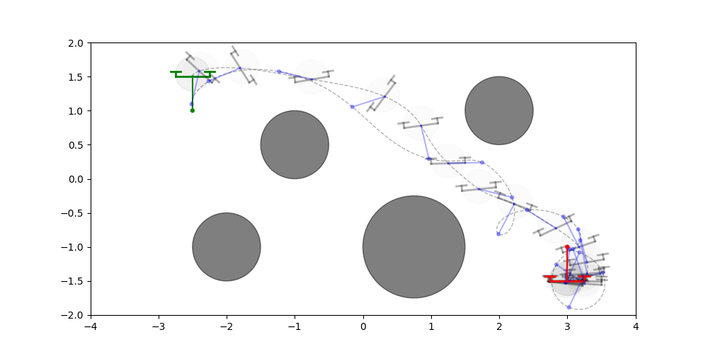
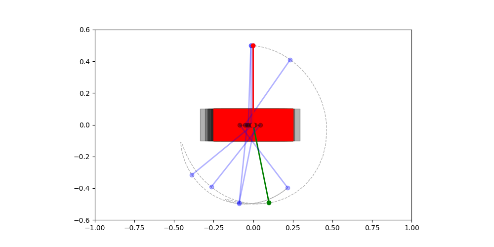

# Primal-Dual Lagrangian Interior Point Method (LIPA)

<p align="center">
  
</p>

<p align="center">
  
  
</p>

This repository implements a numerical method for solving
discrete-time optimal control problems in [JAX](https://github.com/jax-ml/jax),
leveraging the techniques developed in
[Dual-Regularized Riccati Recursions for Interior-Point Optimal Control](https://arxiv.org/abs/2509.16370v5),
and putting to use the [Regularized LQR in JAX](https://github.com/joaospinto/regularized_lqr_jax) code.

This library supports arbitrary non-convex costs, constraints, and dynamics.
The costs and constraints are expected to be stage-wise, but the solver
efficiently supports "cross-stage" optimization variables.

We draw inspiration from [Trajax](https://github.com/google/trajax)
and [MPX](https://github.com/iit-DLSLab/mpx/tree/main).
Here are some ways in which we improve on these libraries:

| Feature                         | Trajax   | MPX     | LIPA |
| ------------------------------- | -------- | ------- | ---- |
| Multiple shooting               | ❌       | ✅      | ✅   |
| Efficient GPU usage             | ❌       | ✅      | ✅   |
| Parallel line search            | ❌       | ✅      | ✅   |
| IPM for inequalities            | ❌       | ❌      | ✅   |
| Cross-stage terms               | ❌       | ❌      | ✅   |
| Iterative refinement            | ❌       | ❌      | ✅   |
| Per-constraint $\rho$           | ❌       | ❌      | ✅   |
| Consistent $\rho$ in LS and KKT | ✅       | ❌      | ✅   |
| Rooted-tree OCPs                | ❌       | ❌      | ✅   |

## Rooted-tree OCPs

LIPA supports arbitrary directed rooted trees through `solve_tree`. Build the
topology and callback-location sets once on the host and reuse them across
solves:

```python
import jax.numpy as jnp

from primal_dual_lipa.optimizers import solve_tree
from primal_dual_lipa.topology import make_tree_ocp_topology
from primal_dual_lipa.types import NodeAndEdgeIndices, OCPCallbackLocations

topology = make_tree_ocp_topology(
    [-1, 0, 0, 1, 1],
    use_parallel_lqr=settings.use_parallel_lqr,
)
locations = OCPCallbackLocations(
    cost=NodeAndEdgeIndices(node=jnp.array([3, 4]), edge=jnp.arange(4)),
    equalities=NodeAndEdgeIndices(
        node=jnp.array([3, 4]), edge=jnp.empty(0, dtype=jnp.int32)
    ),
    inequalities=NodeAndEdgeIndices(
        node=jnp.empty(0, dtype=jnp.int32), edge=jnp.arange(4)
    ),
)
solution, iterations, no_errors, parameters = solve_tree(
    vars_in=initial_variables,
    x0=x0,
    dynamics=dynamics,
    settings=settings,
    node_cost=node_cost,
    edge_cost=edge_cost,
    node_equalities=node_equalities,
    edge_equalities=edge_equalities,
    node_inequalities=node_inequalities,
    edge_inequalities=edge_inequalities,
    topology=topology,
    locations=locations,
)
```

For `V` nodes and `E=V-1` edges, `X` and `Y_dyn` are node-ordered, while `U`
is ordered by `topology.plan.edge_children`. Costs and constraints are explicit
node or edge callbacks: node callbacks receive `(x, theta, node)`, while edge
callbacks receive `(x_parent, u, theta, edge)`. `S`, `Y_eq`, and `Z` are
`NodeAndEdgeValues` pytrees whose rows follow the order of the selected
equality or inequality locations; their `.node` and `.edge` arrays may have
different constraint widths. Cost, equality, and inequality locations are
independent, so callbacks and KKT blocks are built only where they are active.
Omitting `locations` selects every node and edge. Dynamics always uses the edge
callback signature and is evaluated on every edge.

For conventional chain problems, `solve` retains the simpler stage-wise API:
one `(x, u, theta, t)` callback per cost or constraint and flat `Variables`
arrays with `T+1` local-stage rows. Internally, its first `T` stages become edge
blocks and its terminal stage becomes a node block in the same tree solver.

## Benchmark vs. other OCP solvers

The table below summarises iteration counts on a head-to-head benchmark against
several widely-used trajectory-optimisation and NLP solvers, on a fixed set of
analytical and MuJoCo-MJX OCPs. Each cell is `<iterations><status>`; raw CSVs
with full KKT-residual breakdowns live under
[`comparison_results.full_repeats/`](comparison_results.full_repeats/), and the
sweep is reproducible via
[`tests/comparison/run_full_with_repeats.sh`](tests/comparison/run_full_with_repeats.sh).

| solver          | cartpole | acrobot | quadpendulum | quadpendulum_θ | barrel_roll | backflip | jump   | trot  |
|-----------------|----------|---------|--------------|-----------------|-------------|----------|--------|-------|
| acados          | 68✓      | 99✓     | 31✓          | n/a             | —           | —        | —      | —     |
| aligator-casadi | 101✓     | 55✓     | 1000✗        | n/a             | —           | —        | —      | —     |
| aligator-jax    | 114✓     | 55✓     | ⏱            | n/a             | —           | —        | —      | —     |
| csqp-casadi     | 115✓     | 74✓     | 1000✗        | n/a             | —           | —        | —      | —     |
| csqp-jax        | 113✓     | 74✓     | 1000✗        | n/a             | 200✗        | 200✗     | 400✗   | 212✗  |
| fatrop-casadi   | 80✓      | 17✓     | 112✓         | n/a             | —           | —        | —      | —     |
| fatrop-jax      | 99✓      | 17✓     | 112✓         | n/a             | ⏱           | ⏱        | ⏱      | 124✓  |
| ipopt-casadi    | 33✓      | 21✓     | 65✓          | 103✓            | —           | —        | —      | —     |
| ipopt-jax       | 46✓      | 21✓     | 163✓         | 82✓             | 388✗        | 211✗     | 285✗   | 117✓  |
| **lipa-cpu**    | 82✓      | 108✓    | 81✓          | 143✓            | —           | —        | —      | —     |
| **lipa-gpu**    | **84✓**  | **108✓**| **81✓**      | **143✓**        | **70✓**     | **476✓** | **223✓**| **29✓** |
| sip-casadi      | 231✓     | 68✓     | 231✓         | 198✓            | —           | —        | —      | —     |
| sip-jax         | 231✓     | 68✓     | 123✓         | 198✓            | 186✓        | ⏱        | ⏱      | 55✓   |
| trajax          | 310✓     | 86✓     | 237✓         | n/a             | ⏱           | 196✓     | 1027✓  | ⏱     |

**Legend**

| marker          | meaning                                                                                              |
|-----------------|------------------------------------------------------------------------------------------------------|
| `<iters>✓`      | converged                                                                                            |
| `<iters>✗`      | ran iterations and failed (iteration cap hit, divergence, etc.)                                      |
| `⏱`             | subprocess hard-killed at the wall-clock cap (2400 s on MJX problems, 360 s on analytical problems)  |
| `n/a`           | adapter refused the problem (this solver structurally does not support that problem class — typically `theta_dim > 0` in this benchmark) |
| `—`             | the corresponding solver pass did not cover this (solver, problem) pair                              |


## Installation

If you just want to try out the examples in this repository, we suggest
that you [install uv](https://docs.astral.sh/uv/getting-started/installation/).

If you want to add a project dependency on this repository (or `pip install` it), you can use:

```"primal-dual-lipa @ git+https://github.com/joaospinto/primal-dual-lipa"```

## Examples

The examples below are based on the [Trajax](https://github.com/google/trajax)
tests and notebooks, but are modified to make use of some of the features
that are enabled by our solver.

### Quadpendulum

This example, which can be run with `uv run --extra test python -m unittest tests/test_quadpendulum.py`,
optimizes the trajectory of a quadpendulum to reach a target goal-state,
while maximizing the worst-case distance to some circular obstacles.
This requires using cross-stage variables in both the costs and in the constraints.

https://github.com/user-attachments/assets/bba4ad30-25d7-434e-b8cb-861a9fddf0d8

### Backflip

This example, which can be run with
`uv run --extra mpc-examples python -m tests.mpc_examples.run_offline --task h1_backflip --video h1_backflip.mp4`,
optimizes the trajectory of a humanoid robot doing a backflip.

https://github.com/user-attachments/assets/1184ad08-3d06-465b-aca5-5db6e8cb5b0f

### Barrel Roll

This example, which can be run with
`uv run --extra mpc-examples python -m tests.mpc_examples.run_offline --task barrel_roll --video barrel_roll.mp4`,
optimizes the trajectory of a four-legged robot doing a barrel roll.

https://github.com/user-attachments/assets/6b7ffda4-0a14-42ae-8234-8c882b0fb991

### Trotting

This example, which can be run with
`uv run --extra mpc-examples python -m tests.mpc_examples.run_offline --task aliengo_trot --video aliengo_trot.mp4`,
optimizes the trajectory of a four-legged robot trotting.

https://github.com/user-attachments/assets/07b234f9-cd09-4090-a4b0-9ba63a72cd13

### Humanoid jump

This example, which can be run with
`uv run --extra mpc-examples python -m tests.mpc_examples.run_offline --task h1_jump_forward --video h1_jump_forward.mp4`,
optimizes the trajectory of a humanoid doing two consecutive jumps.

https://github.com/user-attachments/assets/78c329e5-c233-4364-9041-3b3fd0689671

### Cartpole

This example, which can be run with `uv run --extra test python -m unittest tests/test_cartpole.py`,
optimizes the trajectory of a quadpendulum to reach a target goal-state,
while imposing some control bounds.

https://github.com/user-attachments/assets/25efb120-253e-48b0-ac14-1dd38f385334

## Citing this work

```bibtex
@misc{2025dualregularizedlqr,
      title={Dual-Regularized Riccati Recursions for Interior-Point Optimal Control}, 
      author={João Sousa-Pinto and Dominique Orban},
      year={2025},
      eprint={2509.16370},
      archivePrefix={arXiv},
      primaryClass={math.OC},
      url={https://arxiv.org/abs/2509.16370},
}
```
